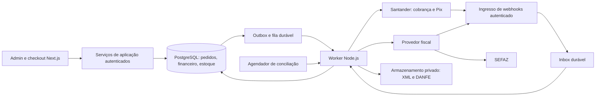

# Evolução do Admin — Santander, NF-e, compras e rastreabilidade

**Data:** 28/09/2026. **Status:** Fase 1 (fundação) implementada — ver §17. **Gateway:** Asaas mantido como principal; Santander adiado — ver §18. **Regime informado:** Simples Nacional. Contratação das APIs Santander, certificado fiscal, credenciamento e provedor fiscal ainda não confirmados.

## 1. Decisão de arquitetura e diagnóstico do repositório

Recomendo manter **Next.js 16 + TypeScript + Prisma 5 + PostgreSQL**, com módulos de domínio e um processo separado para tarefas assíncronas. TypeORM é uma alternativa, mas trocar o ORM simultaneamente à migração financeira acrescentaria risco sem benefício claro para a L&E. O [DDL ilustrativo](./admin-santander-nfe.sql) descreve o núcleo relacional em PostgreSQL; não é uma migration sobre a base atual.

O código já tem `Customer`, `Order`, `OrderItem`, `Payment`, `PaymentPlan`, `WebhookEvent`, comissões, histórico e `FinanceEntry`. Preservar IDs, histórico e contratos públicos. Lacunas observadas:

- `Customer.address` é texto livre; faltam número, bairro, código IBGE e enquadramento de IE.
- `Payment` mistura cobrança e recebimento; `externalId` é globalmente único, sem escopo de conta/ambiente/provedor.
- `Product.stock` é um saldo sem histórico de lotes; não há fornecedor estruturado nem documentos fiscais.
- `PurchaseList` é uma lista de componentes para compra; não representa pedido de compra, recebimento, contas a pagar nem apropriação de custo.
- O webhook Asaas processa efeitos diretamente na requisição; ampliar para inbox/outbox transacionais e processamento recuperável.
- `lib/orders/ledger.ts` considera `CONFIRMADO` e `RECEBIDO` pagos. Preservar essa interpretação histórica durante a transição; não mapear registro de boleto ou criação de Pix Santander para esses estados.
- `lib/asaas.ts` remove tudo que não é dígito do documento. Extrair normalização/validação de CPF/CNPJ para um módulo independente e compatível com CNPJ alfanumérico, sem converter letras em números arbitrariamente.

A Receita já iniciou a implantação do CNPJ alfanumérico, mantendo válidos os CNPJs anteriores. O cadastro deve preservar letras maiúsculas nas primeiras 12 posições e os dois dígitos verificadores; apenas regex não valida o documento. Conferir também a compatibilidade dos provedores contratados. [Receita Federal](https://www.gov.br/receitafederal/pt-br/assuntos/noticias/2026/julho/receita-federal-gera-o-primeiro-cnpj-em-formato-alfanumerico).

## 2. Componentes e implantação



É um **monólito modular com worker**, não uma decomposição inicial em muitos serviços. API e worker compartilham código de domínio e contratos, mas não dependem do ciclo de vida de uma requisição HTTP.

```text
lib/domains/customers/       identidade e endereços
lib/domains/sales/           pedidos, preços e políticas comerciais
lib/domains/payments/        obrigações, cobranças, liquidações e devoluções
lib/domains/fiscal/          validação fiscal, documentos e eventos
lib/domains/inventory/       lotes, reservas, movimentos e produção
lib/domains/purchasing/      fornecedores, compras e recebimentos
lib/integrations/santander/  OAuth, mTLS e adaptação de contratos
lib/integrations/asaas/      compatibilidade e cobranças legadas
lib/integrations/fiscal/     adapter do provedor escolhido
lib/infrastructure/         inbox, outbox, fila, storage, segredos
workers/                    consumidores e conciliação
```

Proposta inicial: outbox e jobs no Postgres, com lease, tentativas e `FOR UPDATE SKIP LOCKED`; worker em processo/serviço Node de longa duração. Uma fila gerenciada pode substituir a entrega de jobs depois, mantendo a outbox. Não usar `setTimeout` ou promessa solta após responder ao webhook para tarefas financeiras. Se o front continuar na Vercel, planejar separadamente a execução durável do worker e a terminação de mTLS de entrada.

## 3. Santander: recebimentos e checkout

Existem contratos diferentes para cobrança de boletos e Pix Recebimentos. O guia de cobrança consultado descreve OAuth, workspace, convênios, registro de boleto e notificações de pagamento/estorno, incluindo Pix associado ao boleto. Os guias públicos encontrados são de 2024; devem ser confrontados com o contrato e o OpenAPI habilitados para a conta antes da implementação. [Santander — Cobrança v2.6](https://developer.santander.com.br/sites/default/files/2024-04/User_Guide_API_de_Cobranca_PT_BR_V2_6.pdf).

A API Pix documenta cobrança imediata com `txid` e expiração em segundos; isso difere de uma cobrança com data de vencimento. Não presumir suporte de `/cobv` ou de qualquer recurso do padrão Bacen sem verificar a oferta Santander contratada. [Santander — Pix Recebimentos](https://developer.santander.com.br/sites/default/files/2024-01/User_Guide_API_PIX_Recebimentos_v11_15_01_24.pdf), [OpenAPI oficial do Banco Central](https://github.com/bacen/pix-api/blob/master/openapi.yaml).

### Experiência do cliente

1. Cliente confirma dados privados do pagador e aceita o total calculado no servidor.
2. Escolhe boleto ou Pix, de acordo com os produtos bancários habilitados.
3. O próprio site apresenta QR Code, Pix Copia e Cola, linha digitável, vencimento/expiração e boleto para baixar/imprimir.
4. A página consulta **nosso backend**, com intervalo e backoff, até a confirmação; não consulta Santander com credenciais no navegador.
5. A autorização do pagamento acontece no aplicativo/canal bancário do pagador. “Checkout transparente” elimina a página de checkout externa; não elimina essa autenticação bancária.

Proposta preferencial para parcelas: boleto com Pix vinculado, se o convênio permitir. É uma obrigação com dois meios de quitação. Não gerar automaticamente um boleto e um Pix independentes pelo mesmo saldo. Se houver meios alternativos independentes, vincular ambos à mesma obrigação, baixar o concorrente quando possível e tratar recebimento duplicado como excesso/crédito ou devolução, com revisão; cancelar um QR não garante impedir pagamento já em andamento.

### Contrato interno do adapter

```ts
interface PaymentGateway {
  createCharge(input: CreateChargeCommand): Promise<ChargeResult>;
  queryCharge(reference: ProviderReference): Promise<RemoteCharge>;
  cancelCharge(reference: ProviderReference): Promise<CancelResult>;
  listSettlements(window: ReconciliationWindow): Promise<SettlementPage>;
  requestRefund(input: RefundCommand): Promise<RefundResult>;
}
```

Operações opcionais têm capability flags. `createCharge` recebe ID interno estável, obrigação, versão do pedido, conta/ambiente, moeda BRL, valores e pagador congelados. `queryCharge` aceita a referência que a API realmente suporta. Não inventar um header de idempotência Santander: quando não existir, usar referência externa estável, consulta de recuperação e tratamento de resultado desconhecido.

### Estados e conciliação

- Cobrança: `CREATING → ACTIVE → SETTLED`, com `UNKNOWN`, `CANCELED`, `EXPIRED`, `FAILED` e indicação de vencimento.
- Vencida não significa cancelada; um boleto vencido pode continuar pagável. Uma liquidação posterior deve ser aceita e conciliada.
- Dinheiro: registros de liquidação distintos de registros de cobrança; pagamento parcial e devolução parcial são eventos próprios.
- Recebimento líquido de taxas não define quitação do cliente. Separar principal quitado, desconto financeiro, juros/multa, taxas e crédito bancário líquido.
- Webhook chega → verificar autenticidade → persistir inbox → responder 2xx. Falha ao persistir exige erro recuperável, não confirmação silenciosa.
- Worker consulta o banco quando necessário, valida conta beneficiária, ambiente, moeda, valor e referência. Processa recebimentos individualmente, inclusive callbacks em lote.
- Dedupe por conta/ambiente/provedor e ID de transação/evento. Pix: preservar `txid` da cobrança e `endToEndId` da transação. Mesmo recebimento notificado por duas APIs não pode gerar duas baixas.
- Processar com lock por obrigação/pedido e restrições únicas. Eventos antigos não fazem uma liquidação voltar a pendente; estorno exige evento/consulta bancária correspondente.
- Agendador propõe consultas incrementais a cada 5–15 minutos, ajustadas aos limites contratados, com paginação, cursor persistido e janela sobreposta. Conciliação diária compara bruto, tarifas, líquido e devoluções. Polling também recupera callbacks perdidos; vencimento/expiração pode ser calculado localmente conforme o contrato.
- Timeout após enviar uma criação: marcar `UNKNOWN`, consultar pela referência e resolver antes de tentar criar novamente. Não trocar automaticamente de provedor em resposta a um timeout.

## 4. Segurança e responsabilidades

- `Client ID`, `Client Secret`, certificados, chave privada e senha de PFX em gestor de segredos. No banco ficam apenas referências, fingerprint, validade e versão. Nunca `NEXT_PUBLIC_*`, Git, logs ou respostas HTTP.
- OAuth client credentials e mTLS conforme o produto bancário; cache de token com expiração e renovação sincronizada. HTTPS server-only em runtime Node, não Edge. Certificado bancário e certificado de assinatura fiscal têm finalidades diferentes; não assumir que um substitui o outro.
- Validar certificado remoto, hostname e cadeia; nunca desligar verificação TLS. Rotação com sobreposição de certificados e alerta prévio de expiração. O Santander publica atualizações de certificados, inclusive em 2026. [Comunicados oficiais](https://developer.santander.com.br/blog).
- mTLS de saída e de entrada são problemas diferentes. Para callbacks que exigirem certificado cliente, usar ingresso que valide o handshake. Não presumir que uma Route Handler na hospedagem atual terá acesso ao certificado do cliente. Se houver proxy, remover cabeçalhos externos e encaminhar identidade autenticada apenas por canal interno protegido. Lista de IPs é complemento, não única autenticação. Não presumir assinatura HMAC Santander sem documentação contratual.
- Controles por usuário e papel: vendas, compras, estoque, financeiro, fiscal e administrador; MFA para administração financeira, autorizações para descontos/devoluções e trilha de auditoria atribuível. Evoluir o login compartilhado do admin antes das operações sensíveis.
- APIs administrativas exigem sessão e permissão; server actions continuam exigindo autorização. Checkout exige conta proprietária ou token de escopo restrito e expirável, com CSRF quando aplicável e rate limits. Nunca aceitar preço, desconto aprovado ou indicador “pago” do navegador como autoridade.
- XML/DANFE em storage privado, acesso autenticado ou URL curta assinada, hash e controle de retenção. O link público `/pedido/[token]` continua sem CPF/CNPJ, endereço e observações internas. Não publicar XML fiscal por esse token genérico.
- Logs operacionais mascarados, payload bruto protegido e com retenção definida. Correlation ID liga pedido, tentativa, callback e documento. Retenção fiscal e LGPD devem ser parametrizadas segundo obrigações aplicáveis, com apoio contábil/jurídico.

## 5. Cadastro fiscal de clientes e do emitente

Cadastro comercial pode ser iniciado incompleto; concluir compra/faturamento exige validação contextual. “Cadastro preenchido” não garante autorização SEFAZ.

| Entidade/campo | Tipo sugerido | Regra |
| --- | --- | --- |
| `Customer.personType` | `PF / PJ` | Não inferir apenas pelo tamanho sem validação |
| `taxId` | `varchar(14)` | CPF ou CNPJ canônico; preservar letras do CNPJ, validar DV |
| `legalName`, `tradeName` | texto | Nome/razão obrigatório para faturar; fantasia opcional |
| `ieIndicator` | `1 / 2 / 9` | Contribuinte, contribuinte isento, não contribuinte |
| `stateRegistration` | texto nullable | IE não é número matemático; preservar zeros; validação por UF |
| `email`, `phone`, `contactName` | texto | Contato operacional, não definir todos como requisitos universais de NF-e |
| `CustomerAddress` | relação 1:N | Separar cobrança, fiscal e entrega |
| `postalCode` | `char(8)` | Validação para endereço brasileiro |
| `street`, `number`, `district` | texto | Número como texto; aceitar “S/N” conforme cadastro e validador fiscal |
| `complement` | texto nullable | Opcional |
| `cityName`, `state` | texto, `char(2)` | Coerentes com município |
| `municipalityIbgeCode` | `char(7)` + FK | Catálogo oficial versionado de municípios |
| `countryCode`, `countryName` | texto | Brasil no MVP; estrangeiros exigem fluxo próprio |
| `fiscalValidatedAt`, `validationIssues` | timestamp, JSON | Evidência de validação; não é selo de garantia SEFAZ |

**“Isento” não é o mesmo que “não contribuinte”.** O usuário escolhe o enquadramento; a aplicação mapeia para `indIEDest` e verifica requisitos da UF/operação. PF pode ser contribuinte, por exemplo produtor rural. Não inferir enquadramento pelo CPF/PJ, nem preencher todos com 9. [Campos documentados de destinatário e IE](https://doc.focusnfe.com.br/reference/emitir_nfe).

`FiscalIssuer` contém CNPJ, razão social, IE, endereço, município, ambiente, regime e CRT confirmado pelo contador, série/numeração, referências de certificado e credenciais. Para a L&E, usar **Simples Nacional como premissa**, verificando eventual excesso de sublimite e outras particularidades antes de fixar CRT. Inscrição ativa, credenciamento e certificado devem estar regularizados para emissão. [Serviços fiscais de Goiás](https://goias.gov.br/economia/documentos-fiscais/).

Congelar os dados do destinatário e do emitente por revisão fiscal/documento. Alterar cadastro posteriormente não reescreve documento autorizado.

## 6. NF-e: regras, provedor e emissão automática

Recomendo inicialmente um **adapter para Focus NFe**, sujeito à homologação comercial/técnica. A API é orientada a documentos e abstrai assinatura/transmissão; a escolha é uma recomendação de arquitetura, não um contrato já aprovado. [Documentação Focus](https://doc.focusnfe.com.br/reference/introducao).

| Alternativa | Quando faz sentido | Contrapartida |
| --- | --- | --- |
| Provedor fiscal especializado | Admin próprio como sistema principal | Contrato, custo por uso, homologação e SLA |
| Bling ou outro ERP | Empresa deseja delegar também operação ao ERP | Definir dono de estoque, clientes e pedidos; evitar dois saldos oficiais |
| Integração SEFAZ direta | Equipe capaz de manter o ciclo fiscal completo | XML, assinatura, schemas, contingência, autorização e eventos ficam sob nossa responsabilidade |

Dados adicionais por produto/operação: NCM, CEST quando aplicável, origem fiscal, unidade comercial e tributável, fator de conversão, GTIN/ausência conforme regra, CFOP definido pelo cenário e CST/CSOSN pertinente. Perfis versionados por vigência, UF de origem/destino, finalidade, contribuinte/consumidor final e regime. Não aplicar um CFOP ou CSOSN único a todas as máquinas e peças, nem copiar a alíquota do DAS para todos os campos da nota.

Também prever frete, seguro, outras despesas, descontos rateados, transporte e referências de documentos. Os schemas e tabelas relacionados à RTC e ao CNPJ alfanumérico estão em evolução; armazenar versão do layout, regras e classificação tributária, com IBS/CBS apenas quando aplicável ao regime/operação/vigência. Não fixar tratamento tributário de 2026 para todos os exercícios. [Portal NF-e — schemas](https://www.nfe.fazenda.gov.br/portal/listaConteudo.aspx?AspxAutoDetectCookieSupport=1&tipoConteudo=BMPFMBoln3w%3D), [Portal NF-e — tabelas técnicas](https://www.nfe.fazenda.gov.br/pOrtaL/listaConteudo.aspx?AspxAutoDetectCookieSupport=1&tipoConteudo=hXzemuyNHW4%3D).

Para o **Simples Nacional**, não habilitar genericamente os grupos IBS/CBS como se a L&E estivesse no regime regular em 2026. A comunicação oficial do CGSN prevê efeitos das adequações, em regra, a partir de 01/01/2027; o sistema precisa guardar a vigência e a opção fiscal efetiva da empresa, confirmadas com o contador. Isso evita tanto exigir campos prematuramente quanto manter um layout antigo após a transição. [Ministério da Fazenda — adequações do Simples](https://www.gov.br/fazenda/pt-br/assuntos/noticias/2026/agosto/cgsn-atualiza-regras-do-simples-nacional-para-adequacao-a-reforma-tributaria-do-consumo).

### Gatilho correto

A confirmação bancária dispara **avaliação de elegibilidade fiscal**, não a autorização automática irrestrita de uma nota pelo valor recebido. A política depende da operação validada pelo contador: venda pronta, encomenda com sinal, faturamento antecipado, entrega futura, remessa, devolução ou serviço. NF-e pode ser necessária antes da quitação, e um pedido pode ter diversas notas. Serviço pode exigir NFS-e, fora do primeiro fluxo de mercadorias.

Para uma venda simples à vista homologada:

1. Confirmar liquidação e aplicar ao principal da obrigação, sem duplicidade.
2. Na mesma transação: atualizar projeções financeiras e inserir `OrderFinancialStateChanged` na outbox.
3. Worker fiscal avalia quitação exigida pela política, operação, dados fiscais, revisão do pedido e itens/quantidades ainda não documentados. Falhas viram pendências específicas no admin.
4. Reservar a operação fiscal com chave única. Congelar destinatário, emitente, itens, valores e tributos. Coordenar a numeração por emitente/ambiente/modelo/série com o provedor; nunca `MAX(numero)+1` sem lock.
5. Enviar para o provedor fora da transação do banco, com referência estável. Recebimento HTTP da solicitação não significa NF-e autorizada. O provedor documenta processamento assíncrono e acompanhamento por consulta/callback. [Focus — emissão](https://doc.focusnfe.com.br/reference/emitir_nfe).
6. Em timeout, consultar a mesma referência antes de reenviar. Usar o identificador interno da operação, não gerar uma nova referência a cada tentativa. Uma referência autorizada não representa uma nova emissão após cancelamento. [Focus — referência](https://doc.focusnfe.com.br/reference/referencia).
7. Callback autenticado ou reconciliação confirma autorização, rejeição ou outro estado. Persistir chave, protocolo, número/série, XML autorizado e DANFE; notificar somente após estado confirmado. Gatilhos podem ser perdidos, portanto manter consultas de recuperação. [Focus — webhooks](https://doc.focusnfe.com.br/reference/webhooks), [configuração de autenticação do webhook](https://doc.focusnfe.com.br/reference/criar_webhook).
8. Rejeição não desfaz pagamento. Mostrar motivo, responsável e ação de correção. Cancelamento de pedido, devolução de dinheiro e cancelamento fiscal são processos independentes, com suas regras e prazos. Não apagar a nota nem inventar uma “desautorização” local.

O modelo admite documentos complementares, devoluções, notas por entrega parcial, eventos e tentativas. A ligação entre um item de pedido e os itens fiscais permite somar a quantidade já faturada, evitando emitir a mesma mercadoria duas vezes. A expedição exige documentação fiscal aplicável; guardar o XML autorizado e protocolo, pois DANFE não substitui a NF-e eletrônica. [Manual oficial NF-e](https://www.confaz.fazenda.gov.br/legislacao/arquivo-manuais/moc7-visao-geral.pdf).

## 7. Modelagem completa por domínio

IDs novos gerados pela aplicação e estáveis, compatíveis com IDs textuais existentes. Valores finais em centavos (`bigint` no desenho; migração dos `Int` atuais deve ser deliberada). Quantidades e custos unitários fracionários em `numeric`, nunca `float`. BigInt/Decimal são serializados como strings na API. Datas de vencimento como `date`; instantes como `timestamptz` em UTC, apresentados em America/Sao_Paulo.

| Tabela | Campos centrais e relações |
| --- | --- |
| `FiscalIssuer` | CNPJ, razão, IE, regime/CRT, endereço, ambiente, referências de segredo |
| `Municipality` | código IBGE PK, nome, UF, vigência/status |
| `Customer` | tipo, documento, nome/razão, IE/indicador, contatos, validação; vínculo com `User` existente |
| `CustomerAddress` | cliente FK, finalidade, CEP, logradouro, número, complemento, bairro, município FK |
| `CustomerActivity` | cliente FK, tipo, resumo, responsável, data, próxima ação; sem duplicar pedido/pagamento como texto autoritativo |
| `Supplier` | documento, razão, IE, endereço/contatos, prazo negociado, ativo; vincular a compras e recebimentos |
| `Product` | SKU, descrição, preço padrão, unidade, política de desconto, tipo comprado/fabricado; preservar catálogo |
| `ProductCostRevision` | produto, custo unitário decimal, método, vigência, origem e autor; histórico, não sobrescrever custo de venda anterior |
| `TaxProfileVersion` | emitente/produto ou grupo, vigência, cenário, NCM/CEST/origem/unidades e regras tributárias validadas |
| `ProductSupplier` | produto + fornecedor únicos, código externo, custo cotado, prazo e data da cotação |
| `Order` | cliente, status comercial, logístico e financeiro distintos; versão, totais e política de pagamento/fiscal |
| `OrderItem` | produto FK opcional para histórico, SKU/descrição/unidades congelados, quantidade, preço e custo, descontos, total e perfil fiscal versionado |
| `OrderRevision` | pedido, versão única, alterações aprovadas e snapshots; cobrar sempre uma revisão identificada |
| `PaymentPlan` | plano existente, entrada, parcelas e termos; futura versão de juros em decimal/BPS |
| `Receivable` | pedido/plano, parcela, principal, vencimento, saldo/projeção; uma dívida que pode ter diferentes tentativas de cobrança |
| `GatewayAccount` | emitente, provedor, ambiente, convênio/workspace/chave Pix, referências de segredo, capacidades |
| `PaymentCharge` | obrigação FK, conta FK, método, estado, valor, referência estável, ID remoto, txid/nosso número, linha digitável, payload Pix, expiração |
| `Settlement` | conta/ID externo únicos, cobrança opcional, E2EID, bruto, taxas, líquido, data, origem; admite recebimento ainda não identificado |
| `PaymentAllocation` | liquidação + obrigação, valor aplicado ao principal, ajuste/desconto, acréscimos, tipo aplicação/estorno, referência reversa |
| `Refund` | liquidação FK, valor, idempotência, referência remota, solicitado/processando/confirmado/falhou; não subtrair dinheiro só por solicitar |
| `FiscalOperation` | pedido, revisão, emitente, finalidade, entrega, chave de negócio única, estado e snapshots |
| `FiscalDocument` | operação FK, ambiente, modelo, série/número, chave, protocolo, estado, referência do provedor, objetos privados e hashes |
| `FiscalDocumentItem` | documento, item de pedido, quantidade, valores e tributos congelados |
| `FiscalAttempt` / `FiscalEvent` | histórico de transmissões/respostas e cancelamentos/correções/eventos, sem apagar tentativas |
| `PurchaseOrder` / `PurchaseOrderItem` | fornecedor, aprovação, prazo, produto, quantidade, custo, impostos/frete e saldo a receber |
| `GoodsReceipt` / `GoodsReceiptItem` | compra/item, fornecedor, documento de entrada, quantidade aceita/rejeitada, lote, custo apropriado; recebimento parcial |
| `SupplierPayable` | fornecedor, compra/documento, parcela, valor, vencimento, saldo; integrar a `FinanceEntry` por referência única |
| `SupplierPayment` | obrigação a pagar, valor, data, meio, comprovante e aprovação; pagamentos bancários de saída exigem integração distinta |
| `Warehouse` / `StockLot` | local; produto, código de lote, origem, recebimento ou produção, datas e custo; origem comercial separada da origem fiscal |
| `StockSerial` | produto, lote, serial único, situação e histórico; útil para máquinas/cabeçotes individualizados |
| `InventoryMovement` | lote/local, quantidade assinada, tipo, fonte/item, operação idempotente, autor/data, reversão; imutável |
| `StockReservation` / `InventoryBalance` | reserva por item/lote/local, quantidade e validade; saldo como projeção verificável do livro de movimentos |
| `ProductionOrder` / `ProductionConsumption` | produto e lote produzidos; lotes/quantidades de componentes consumidos; genealogia de fabricação |
| `Shipment` / `ShipmentItem` | pedido, itens/quantidades, lotes/seriais, transportadora, rastreio, notas vinculadas, datas |
| `WebhookInbox` | conta/provedor/ID ou chave de dedupe, payload protegido, estado, tentativas, lease, erro e data |
| `OutboxEvent` / `Job` | evento único de negócio, aggregate/version, payload mínimo, disponibilidade, lease, tentativas e conclusão |
| `ReconciliationRun` / `ReconciliationIssue` | conta, janela/cursor, resultados, divergências e resolução auditada |
| `AuditLog` | usuário/serviço, ação, entidade, mudanças mascaradas, correlação e instante |

As tabelas de custos, produção, compras e estoque não são substituídas por um campo JSON genérico. JSON é adequado para snapshots fiscais versionados e payloads externos, com schema validado.

### Restrições que impedem duplicidade

- `GatewayAccount` separa empresa, banco e homologação/produção.
- `PaymentCharge`: UNIQUE(conta, reference) e UNIQUE(conta, externalId) quando preenchido; txid exclusivo no escopo aplicável.
- `Settlement`: UNIQUE(conta, externalId) e E2EID único no escopo de conta; normalização entre callbacks do boleto/Pix.
- `WebhookInbox`: UNIQUE(conta, dedupeKey). Persistência duplicada não implica efeito duplicado; o worker precisa de exclusão mútua e transação.
- `FiscalOperation`: UNIQUE(emitente, businessKey). Chave identifica finalidade + pedido/revisão + entrega ou grupo fiscal, não simplesmente um pagamento.
- `FiscalDocument`: UNIQUE(emitente, ambiente, modelo, série, número), além da chave de acesso quando disponível. Uma operação de emissão tem um documento lógico, com várias tentativas.
- `InventoryMovement`: UNIQUE(operationKey, lineNo), permitindo lançamentos pareados de transferência; reversão referencia o movimento original.
- Valores e quantidades válidos com CHECK; exclusões financeiras/fiscais restritas; soft delete para cadastros usados historicamente.
- As somas entre linhas — alocações ≤ recebimento disponível, devoluções ≤ recebido, reservas ≤ disponível, faturado ≤ elegível — são invariantes transacionais com locks, não CHECKs simples de uma coluna.

## 8. Custos, margem e descontos

Guardar custo e preço praticados no item vendido. Custos posteriores do produto não podem alterar a margem histórica.

```text
receita líquida comercial = itens − descontos comerciais
margem bruta = (receita líquida comercial − custo dos itens) / receita líquida comercial
markup = (preço − custo) / custo
```

Exemplo: custo R$ 600, venda R$ 1.000 → margem 40%, markup 66,67%. Com desconto de R$ 100, margem ≈33,33%. Impostos, comissão, frete subsidiado e taxa bancária entram separadamente na **margem de contribuição**. Divisões por zero retornam “não calculável”. Não chamar margem bruta de lucro líquido.

Pedido guarda preço de tabela, preço negociado, desconto em centavos e motivo/aprovador. O servidor valida limites e recalcula valores. Rateio de desconto do pedido e frete por item com regra determinística de centavos e reconciliação com totais fiscais. Encargos de atraso não reescrevem retroativamente o preço comercial.

## 9. Compras, estoque e rastreabilidade

Fluxo proposto: necessidade/lista atual → compra aprovada → recebimento parcial/total → inspeção → entrada de lote → custo apropriado → conta a pagar → pagamento aprovado.

Disponível = saldo físico apto − reservas ativas. Reservar não é baixar estoque. Saída acontece no evento operacional definido (ex.: expedição), uma única vez. Transferências usam saída/entrada pareadas na mesma transação; inventário e devoluções produzem ajustes auditados. Mercadoria devolvida vai à inspeção/quarentena antes de voltar a disponível.

Para fabricação: lote do fornecedor → consumo em ordem de produção → lote/serial acabado → item expedido → cliente/documento fiscal. Isso permite localizar todos os clientes afetados por uma matéria-prima e todos os componentes de uma máquina. A definição de FIFO/custo médio e apropriação de mão de obra/frete deve ser explicitada; FIFO de seleção física não precisa ser igual ao método contábil de custeio.

A conta Santander para **receber** boleto/Pix não autoriza automaticamente **pagar** fornecedores, folha ou tributos. No MVP, contas a pagar podem registrar pagamentos/comprovantes, integradas ao financeiro existente. Uma futura API de pagamentos de saída demanda produto bancário próprio, limites, dupla aprovação e reconciliação específica. Não substituir remuneração/comissões atuais nesta primeira migração.

## 10. Admin e CRM

O Kanban pode mostrar Novo → Aguardando pagamento → Pronto para faturar → Em separação → Enviado → Entregue. Cada card também mostra badges independentes de pagamento e fiscal, além de pendências. Preservar Em fabricação para encomendas. “Pago/NF emitida” não deve ser um único enum persistido: pedido pago pode ter rejeição fiscal; venda a prazo pode estar faturada e ainda ter saldo.

- Financeiro: a receber, vencidos, pagamentos não identificados, divergências e devoluções em andamento.
- Fiscal: rascunhos elegíveis, dados faltantes, documentos em processamento, rejeitados e autorizados.
- Estoque/compras: faltas, reservas, compras atrasadas, recebimentos parciais, lotes e seriais.
- CRM 360: pedidos, valores recebidos, saldo aberto/vencido, contatos, atividades e prazos. Ticket médio = total líquido comercial dos pedidos válidos no período / quantidade desses pedidos, sem multiplicar pedido por parcelas. Definir quais status comerciais entram no indicador; pagamentos recebidos e receita de vendas são métricas diferentes.
- Inadimplência deriva de obrigações vencidas com saldo, considerando estornos/renegociações. Nunca persistir apenas um booleano sem origem/atualização.
- Ações rápidas continuam em Sheets; tarefas de longa duração mostram protocolo e estado de processamento.

## 11. Orquestração e concorrência

```text
POST pedido (Idempotency-Key)
  autorizar usuário e validar versão/preços/dados
  TX A: pedido + itens/snapshots + obrigação + reserva + outbox
  COMMIT → responder pedido e estado

worker de cobrança
  adquirir job com lease e conta/ambiente corretos
  TX B: criar/recuperar Charge CREATING por referência estável
  chamar Santander fora da TX
  TX C: persistir resultado e instrumentos; timeout → UNKNOWN

webhook
  autenticar origem, validar tamanho/schema
  TX D: inserir Inbox única; COMMIT → 2xx

worker de conciliação
  consultar/validar estado bancário fora da TX
  TX E, com locks: Settlement/Refund + alocações + projeção do pedido
    + auditoria + evento fiscal único na Outbox
  COMMIT

worker fiscal
  avaliar política e contexto; pendências não bloqueiam o recebimento
  TX F: reservar operação fiscal e snapshot
  enviar/consultar provedor fora da TX
  TX G: resultado, artefatos privados e outbox de notificação
```

`Idempotency-Key` interna tem escopo de ator/operação/conta, hash da requisição e resultado guardado. Reuso com payload diferente responde conflito. Jobs usam exponential backoff com jitter, limite de tentativas e fila de análise manual. Falha após efeito remoto é recuperada por consulta, não por nova criação indiscriminada.

## 12. Endpoints internos fundamentais

Os caminhos abaixo são propostas da L&E, não rotas oficiais do Santander. Server Actions podem chamar os mesmos serviços; evitar dois caminhos com regras divergentes. Listagens paginadas e filtráveis. Comandos financeiros/fiscais usam idempotência, permissão e versão do agregado.

| Método / rota | Função e acesso |
| --- | --- |
| `GET/POST /api/admin/customers` | Listar/criar clientes; vendas |
| `GET/PATCH /api/admin/customers/:id` | Cadastro e contatos; controle de versão |
| `POST /api/admin/customers/:id/fiscal-validation` | Validar dados e listar pendências; não garante autorização |
| `GET /api/admin/customers/:id/overview` | CRM agregado com histórico paginado |
| `GET /api/municipalities?uf=GO&q=...` | Consulta ao catálogo de municípios |
| `GET/POST /api/admin/products` | Cadastro e preços; aproveitar serviços atuais |
| `POST /api/admin/products/:id/cost-revisions` | Novo custo histórico aprovado |
| `GET/POST /api/admin/tax-profiles` | Perfis fiscais versionados; papel fiscal |
| `GET/POST /api/admin/orders` | Pedidos; preservar fluxo atual |
| `GET/PATCH /api/admin/orders/:id` | Leitura/alteração comercial versionada |
| `POST /api/admin/orders/:id/transitions` | Transição validada, em vez de status arbitrário |
| `POST /api/admin/orders/:id/payment-plans` | Entrada/parcelas, sem duplicar obrigações |
| `POST /api/checkout/orders/:id/charges` | Criar/recuperar instrumento; cliente proprietário ou token restrito |
| `GET /api/checkout/charges/:id` | Estado, QR/linha, validade e instruções permitidas |
| `GET /api/checkout/charges/:id/boleto` | Boleto autorizado; download pela aplicação |
| `POST /api/admin/charges/:id/cancel` | Baixa/cancelamento de cobrança, sujeito ao banco |
| `POST /api/admin/settlements/:id/refunds` | Solicitar devolução com permissão/aprovação |
| `POST /api/webhooks/santander/billing` | Callback bancário autenticado, sem sessão humana |
| `POST /api/webhooks/santander/pix` | Callback Pix; adaptar caminho exigido pelo contrato |
| `POST /api/webhooks/fiscal/:provider` | Callback fiscal autenticado |
| `POST /api/admin/reconciliation-runs` | Enfileirar consulta/recuperação; financeiro |
| `GET /api/admin/reconciliation-issues` | Divergências e recebimentos não identificados |
| `POST /api/admin/orders/:id/fiscal-operations` | Preparar/solicitar faturamento elegível |
| `GET /api/admin/fiscal-documents/:id` | Estado e motivos de rejeição |
| `POST /api/admin/fiscal-documents/:id/retry` | Reprocessar com a mesma identidade quando permitido |
| `POST /api/admin/fiscal-documents/:id/cancel` | Evento fiscal; não devolve pagamento automaticamente |
| `POST /api/admin/fiscal-documents/:id/events` | Correção/eventos suportados com validação |
| `GET /api/account/fiscal-documents/:id/files/:kind` | XML/DANFE apenas do cliente autorizado |
| `GET/POST /api/admin/suppliers` | Cadastro de fornecedores |
| `GET/POST /api/admin/purchase-orders` | Compras e itens |
| `POST /api/admin/purchase-orders/:id/approve` | Aprovação segregada |
| `POST /api/admin/purchase-orders/:id/receipts` | Recebimento parcial, lotes e custos |
| `GET/POST /api/admin/supplier-payables` | Contas a pagar vinculadas à compra |
| `POST /api/admin/supplier-payables/:id/payments` | Registrar pagamento/comprovante no MVP |
| `GET /api/admin/inventory/lots/:id/trace` | Origem, consumo e clientes destinatários |
| `POST /api/admin/inventory/adjustments` | Ajuste justificado; nunca editar saldo diretamente |
| `POST /api/admin/inventory/transfers` | Transferência atômica entre locais |
| `POST /api/admin/production-orders/:id/complete` | Consumo e lote produzido conforme política |
| `POST /api/admin/orders/:id/shipments` | Expedição/baixa após requisitos aplicáveis |
| `POST /api/admin/shipments/:id/delivery` | Confirmação de entrega auditada |

Criações assíncronas retornam `202` com ID e URL de acompanhamento. `409` sinaliza versão/idempotência conflitante; `422`, pendência de negócio/cadastro. HTTP 200/202 de um provedor nunca é traduzido automaticamente em “pago” ou “autorizado”.

## 13. Plano de implementação e migração

| Fase | Entrega | Critério para avançar |
| --- | --- | --- |
| 0 — contratos e decisões | Convênio Santander/Pix, OpenAPI ativo, ambientes/certificados; emitente/CRT e matriz fiscal; escolha do provedor | Sandbox funcional e cenários fiscais aprovados pelo contador |
| 1 — fundação | Usuários/perfis, migrações aditivas, inbox/outbox, jobs, auditabilidade, segredos | Reinício/replay não perde evento nem duplica efeito |
| 2 — cadastros | CPF/CNPJ alfanumérico, endereços estruturados, município, fornecedor e perfil fiscal | Diagnóstico de pendências dos cadastros reais; sem inventar dados ausentes |
| 3 — Santander | Adapter, checkout, boleto/Pix, liquidação e polling | Fluxos completos homologados, timeout e evento duplicado tratados |
| 4 — fiscal | NF-e em homologação, snapshots, consulta, rejeição, XML/DANFE e eventos | Emissão e recuperação de timeout sem duplicar nota; política fiscal validada |
| 5 — compras e estoque | Compra/recebimento, custos, lotes, movimentos, reservas, produção e expedição | Rastrear uma máquina do fornecedor ao cliente e reconciliar saldo |
| 6 — Admin e CRM | Visões por domínio, Kanban, pendências e métricas | Equipe conclui ciclo operacional sem planilhas paralelas essenciais |
| 7 — piloto e corte | Feature flag Santander para novas cobranças; observabilidade e treinamento | Conciliação diária sem divergências inexplicadas e plano de rollback testado |

Durante a fase fiscal, compras/estoque podem ser modelados em paralelo no cronograma; não é autorização para emitir NF-e de produção antes da validação fiscal. Não fixar calendário de entrega antes de conhecer habilitação bancária, documentação e volume de saneamento cadastral.

### Migração sem duplicar cobrança

1. Exportar/conciliar a base e identificar cobranças Asaas abertas, parceladas, pagas e em estorno. Criar migrações versionadas aditivas, mantendo os campos legados.
2. Introduzir novas entidades e vínculo único `legacyPaymentId`. Não converter cobrança pendente em recebimento, nem criar transação bancária fictícia para preencher lacunas. Históricos agregados ficam identificados como importação e são confrontados com extratos.
3. Preservar `PaymentPlan`, comissões, `Order.paidCents` e projeções usadas no painel. Evoluir `recalcOrder` para consumir a nova fonte por adapter; nunca somar `Payment` legado e `Settlement` espelhado duas vezes.
4. Operar conciliação Santander em homologação; depois piloto explícito e controlado de novas cobranças. Cobranças Asaas abertas permanecem no Asaas até liquidar/cancelar segundo o procedimento acordado.
5. Não trocar o provider de uma linha histórica nem recriar automaticamente boletos ativos. Para substituir cobrança, confirmar baixa e resolver eventual pagamento em trânsito; comunicar a alteração pelo fluxo comercial autorizado.
6. Rollback desativa a criação de novas cobranças Santander. Mantém callbacks, polling, documentos e recebimentos já existentes dos dois bancos. Desligar o listener não é rollback seguro.
7. Saldos iniciais de estoque entram por inventário auditado, com lote de abertura identificado. Não inventar fornecedor ou genealogia histórica ausente.
8. Remover campos/integrações antigos só após encerramento das pendências e retenção aplicável; nada de apagar o histórico para “limpar” a migração.

## 14. Testes e critérios de aceite

- Pix/boleto: criação, vencimento/expiração, pagamento normal/tardio/parcial, desconto, juros, tarifa, duplicado, pagador não identificado, devolução parcial e falha de baixa.
- Resiliência: webhook duplicado/fora de ordem, evento em lote, queda após commit/antes do ACK, reinício do worker, timeout após efeito remoto, rate limit e certificado expirando.
- Concorrência: duas abas criando cobrança, dois workers liquidando o mesmo recebimento, duas expedições para o último item, faturamento concorrente da mesma quantidade.
- Fiscal: PF, PJ contribuinte/isento/não contribuinte, produtor rural PF, CNPJ numérico/alfanumérico, operação interna/interestadual, sinal, parcela, entrega parcial, rejeição, resposta perdida, cancelamento permitido/negado e documentos não autorizados.
- Estoque: recebimento parcial, transferência, reserva vencida, devolução com inspeção, consumo de componentes e rastreio inverso.
- Segurança: isolamento por cliente, papéis administrativos, CSRF, tokens, callbacks forjados, dados mascarados e downloads privados.
- Regressão: parcelas com entrada, totais, comissões, folha e financeiro atuais; link público do pedido continua sem dados privados.
- Não emitir documento fiscal real nem movimentar dinheiro como teste automatizado; homologação primeiro e piloto produtivo expressamente autorizado.

## 15. Decisões ainda necessárias

1. Quais produtos Santander estão habilitados: Cobrança, boleto com Pix vinculado, Pix Recebimentos; conta/convênio e OpenAPI vigentes.
2. Dados fiscais do emitente, CRT efetivo no Simples, certificado aceito pelo provedor e credenciamento em Goiás.
3. Matriz do contador para produção própria/revenda, sinais, entrega futura, interestaduais, serviços e devoluções.
4. Provedor fiscal e responsáveis pelo saneamento dos cadastros.
5. Critério comercial de reserva, fabricação, faturamento e liberação de entrega; permissões de desconto/devolução.
6. Necessidade futura de pagamentos bancários de saída e método de custeio.

A documentação pública embasa o desenho; limites, autenticação exata, payloads e habilitação devem ser confirmados com a conta contratada. Este documento não garante ausência de rejeições fiscais e não executa migração, cobrança ou emissão.

## 16. Alcance dos exemplos e verificação

O SQL contém 32 tabelas exemplificativas do núcleo. As relações `REFERENCES` apontam para tabelas presentes no próprio exemplo; a documentação descreve também entidades de apoio não expandidas. Identificadores legados comentados precisam virar FKs para os modelos reais quando a migration for escrita. O arquivo não foi aplicado nem validado contra um servidor PostgreSQL nesta rodada: é material de arquitetura a adaptar ao Prisma e à base existente. `git diff --check` passou. Não foi necessário build porque não houve alteração da aplicação, dependências, dados ou schema ativo.

## 17. Andamento da implementação

### Fatia 1 — fundação (28/09/2026)

Tudo que não depende de contrato Santander, provedor fiscal ou contador:

| Entrega | Onde | Observação |
| --- | --- | --- |
| CPF/CNPJ numérico e alfanumérico | `lib/domains/customers/tax-id.ts` | Substitui `isValidCpfCnpj`. Documento salvo na forma canônica (`[0-9A-Z]`); registros antigos com pontuação continuam válidos e são comparados por `sameTaxId`. Asaas recebe o canônico (letras preservadas). |
| Fila durável + outbox | `lib/infrastructure/jobs/` · modelo `Job` | Postgres, lease, `FOR UPDATE SKIP LOCKED`, backoff com jitter, `DEAD` após 8 tentativas, `concurrencyKey` (um job por chave por vez). |
| Inbox de webhooks | modelo `WebhookInbox` · `lib/integrations/asaas/webhook.ts` | Webhook Asaas: autentica → inbox + job na mesma transação → 2xx → `after()` executa. O job consulta a cobrança no Asaas (estado vigente), então eventos fora de ordem convergem. `WebhookEvent` fica só como histórico. |
| Execução | `after()` na rota · `GET /api/cron/jobs` (Bearer `CRON_SECRET`) · `npm run worker` | Na Vercel não há processo contínuo: `after()` é o caminho rápido e o cron/monitor recupera o que ficou para trás. |
| Painel | `/admin/integracoes` | Contagem por estado, jobs parados com erro e “Tentar de novo”, últimos webhooks. Badge no menu quando há job `DEAD`. |
| Municípios IBGE | modelo `Municipality` · `npm run db:municipios` · `GET /api/municipalities?uf=GO&q=` | 5.571 municípios; extintos ficam inativos. |

Decisões que ajustam o desenho acima:

- **Outbox e Job são a mesma tabela.** O job é gravado na transação do fato de negócio; separar `OutboxEvent` de `Job` só acrescentaria um despachante sem ganho neste volume. Uma fila gerenciada pode ser plugada depois lendo a mesma tabela.
- **Centavos continuam `Int`** (teto ≈ R$ 21 milhões por valor). Migrar para `bigint` fica para quando houver necessidade real.
- **Migrations aditivas, sem apagar nada**: `20260928120000_jobs_webhook_inbox` e `20260928130000_municipalities`.

Testes: `npm test` (unitários sempre; integração com `TEST_DATABASE_URL` apontando para um Postgres descartável — os testes apagam tabelas).

### Fatia 2 — cadastro fiscal do cliente (28/09/2026)

| Entrega | Onde | Observação |
| --- | --- | --- |
| Campos fiscais | `Customer.tradeName`, `ieIndicator` (1/2/9), `stateRegistration` | Enquadramento é escolhido, nunca deduzido do CPF/CNPJ. IE guardada como texto (zeros e letras preservados). |
| Endereço estruturado | modelo `CustomerAddress` (PRINCIPAL/ENTREGA) com FK para `Municipality` | Os campos livres antigos (`address/city/state/zip`) viram espelho do PRINCIPAL, então PDF, Asaas e telas antigas seguem iguais. |
| Diagnóstico | `lib/domains/customers/fiscal-readiness.ts` | Pendências (impedem faturar) e avisos (ex.: sem e-mail para XML/DANFE). Aparece no cadastro, na lista (filtro “Com pendências”) e no pedido. |
| Formulários | `components/customers/FiscalFields.tsx` | Admin e portal: CEP preenche rua/bairro/cidade (ViaCEP via `/api/cep/[cep]`, conferido com o IBGE); cidade com sugestões do catálogo. No portal a pergunta da IE é em linguagem de cliente. |
| Saneamento | `npm run db:enderecos` · `npm run db:normalizar-docs` | Os dois começam em modo relatório e só gravam com `--apply`. O texto livre vai inteiro para o logradouro; número e bairro ficam como pendência. |
| Catálogo em produção | migration `20260928131000_seed_municipalities` | Os 5.571 municípios entram no deploy; `db:municipios` só atualiza. |

A validação do dígito verificador da IE por UF fica com a SEFAZ/provedor fiscal: são 27 algoritmos diferentes e o custo de manter isso não compensa agora.

Próximas fatias sugeridas, ainda sem dependência externa: (a) usuários e papéis do admin + `AuditLog` (Better Auth já está no projeto); (b) domínio de pagamentos sobre o Asaas (§18): obrigação/recebível separado da cobrança e conciliação diária pela API; (c) cadastro fiscal do produto (NCM, origem, unidade, CFOP/CSOSN por perfil), que depende da matriz do contador.

## 18. Decisão de gateway: manter o Asaas (28/09/2026)

**Decisão:** o Asaas continua sendo o único gateway de recebimento. A integração Santander (§3) fica **adiada**, e não descartada: o contrato `PaymentGateway`, a inbox e a fila (§17) servem a qualquer provedor.

| Critério | Asaas (hoje) | Santander (Cobrança + Pix) |
| --- | --- | --- |
| Cartão de crédito / parcelado | Sim, na fatura do Asaas | Não. Cartão seria outro contrato (adquirente) e outra integração |
| Pix e boleto | Sim, inclusive o cliente escolhendo na fatura | Sim, com convênio de cobrança e Pix habilitados |
| Integração | Pronta, em produção, com sandbox e webhook com token | OAuth + mTLS, certificado, workspace/convênio; guias públicos de 2024 a confrontar com o contrato |
| Operação | Régua de avisos, fatura hospedada, antecipação e conciliação num lugar | Tarifas negociáveis; conciliação com o extrato bancário |
| Custo | Tarifa por transação (conferir a tabela vigente da conta) | Tende a ser menor em boleto/Pix com volume e relacionamento; depende do convênio |

Faz sentido rever a decisão quando o volume de boleto/Pix tornar a diferença de tarifa relevante. Nesse caso, entraria o Santander **só para boleto/Pix**, como segundo adapter, e o Asaas continuaria no cartão. Nunca os dois cobrando a mesma obrigação (§3, “dois meios de quitação”).

**Pendência crítica:** a conta Asaas em uso está no CNPJ 55.011.626 (pessoa do sócio), não no da L&E. O recebimento precisa cair na mesma empresa que emite a NF-e, senão receita e nota ficam em CNPJs diferentes. Abrir/migrar a conta Asaas para o CNPJ da L&E antes de vender em volume e antes da Fase 4, e validar com o contador.

**NF-e:** o módulo de notas do Asaas atende NFS-e (serviços). A NF-e de mercadorias (máquinas e peças) continua no provedor fiscal da §6 (Focus NFe recomendado). Confirmar na conta se o Asaas passou a oferecer NF-e de produto antes de contratar outro provedor.

Efeito no plano (§13): a Fase 3 passa a ser “evolução do domínio de pagamentos sobre o Asaas” (obrigação/recebível separado da cobrança, cartão/Pix/boleto na mesma obrigação, conciliação diária pela API do Asaas). O adapter Santander vira fase opcional.
